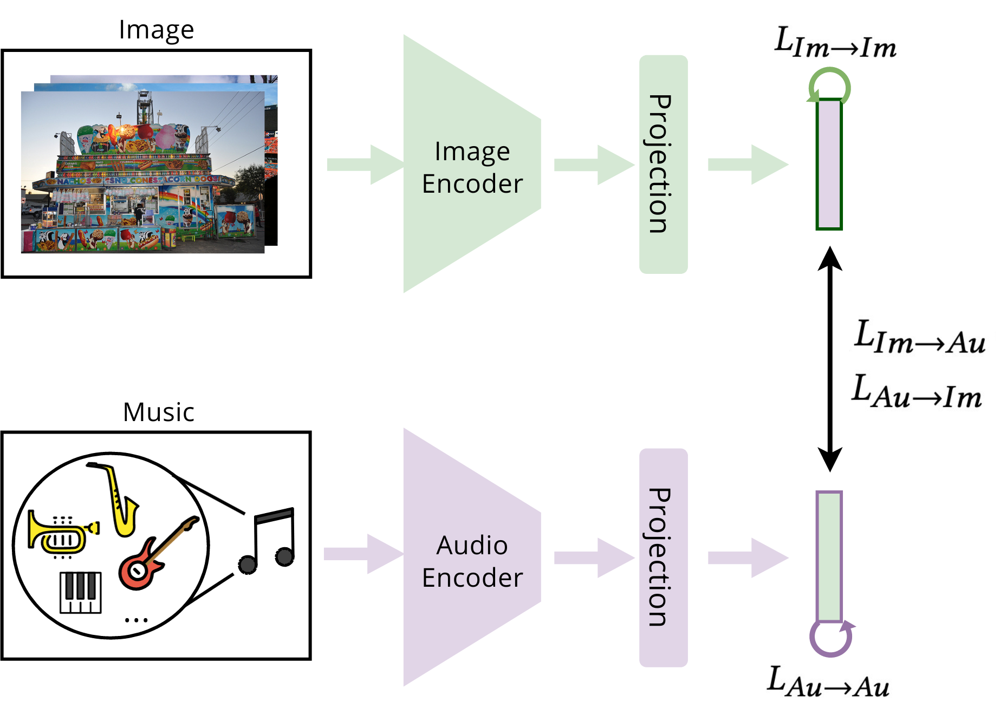

<div align="center">

# Emotion-Aligned Contrastive Learning Between Images and Music
[Shanti Stewart](https://www.linkedin.com/in/shanti-stewart/)<sup>1</sup>,
[Kleanthis Avramidis](https://klean2050.github.io/)<sup>1</sup>,
[Tiantian Feng](https://www.linkedin.com/in/tiantian-feng-b4367989/)<sup>1</sup>,
[Shrikanth Narayanan](https://viterbi.usc.edu/directory/faculty/Narayanan/Shrikanth/)<sup>1</sup> <br>
<sup>1</sup>  Signal Analysis and Interpretation Lab, University of Southern California

[](https://arxiv.org/abs/2308.12610)

<p align="center">

</p align="center">

</div>


This repository is the official implementation of [Emotion-Aligned Contrastive Learning Between Images and Music](https://arxiv.org/abs/2308.12610) (accepted at ICASSP 2024).

In this work, we introduce **Emo-CLIM**, a framework for <ins>Emo</ins>tion-Aligned <ins>C</ins>ontrastive <ins>L</ins>earning Between <ins>I</ins>mages and <ins>M</ins>usic. Our method learns an emotion-aligned joint embedding space between images and music. This embedding space is learned via emotion-supervised contrastive learning, using an adapted cross-modal version of SupCon. By evaluating the joint embeddings through downstream cross-modal retrieval and music tagging tasks, we show that our approach successfully aligns images and music.

We provide code for contrastive pre-training and downstream cross-modal retrieval and music tagging evaluation tasks.


## Installation

We recommend using a conda environment with ``Python >= 3.10`` :
```
conda create -n emo-clim python=3.10
conda activate emo-clim
```
Clone the repository and install the dependencies:
```
git clone https://github.com/shantistewart/Emo-CLIM
cd Emo-CLIM && pip install -e .
```

You will also need to install the CLIP model:
```
pip install git+https://github.com/openai/CLIP.git
```


## Project Structure

```
Emo-CLIM/
├── climur/               # core directory for pretraining and downstream evaluation
│  ├── dataloaders/          # PyTorch Dataset classes
│  ├── losses/               # PyTorch loss functions
│  ├── models/               # PyTorch Module classes
│  ├── scripts/              # training and evaluation scripts
│  ├── trainers/             # PyTorch Lightning LightningModule classes
│  └── utils/                # utility functions
├── configs/              # configuration files for training and evaluation
├── data_prep/            # data preparation scripts
├── figures/              # Emo-CLIM figures
├── plots/                # t-SNE plots
├── results_test/         # cross-modal retrieval evaluation results on test set
├── results_val/          # cross-modal retrieval evaluation results on validation set
└── tests/                # test scripts
```

